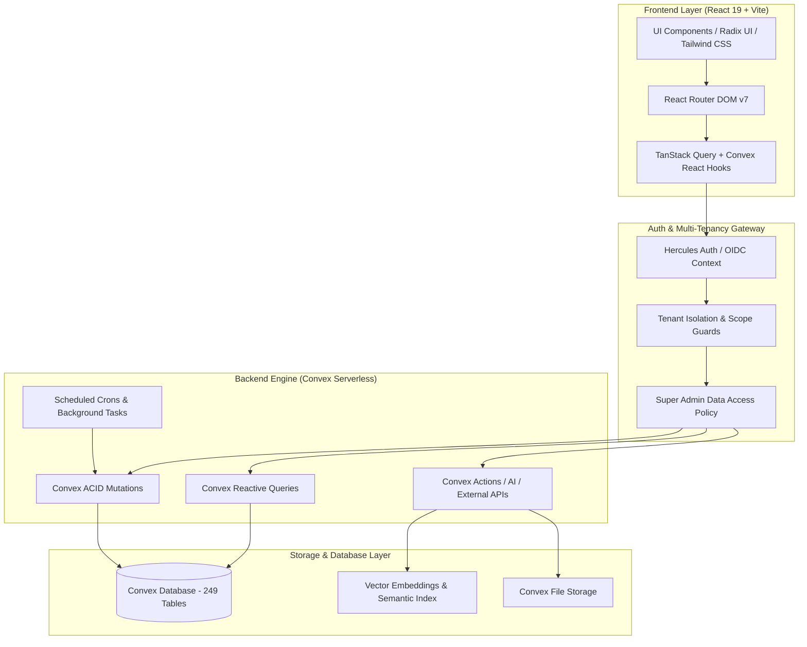
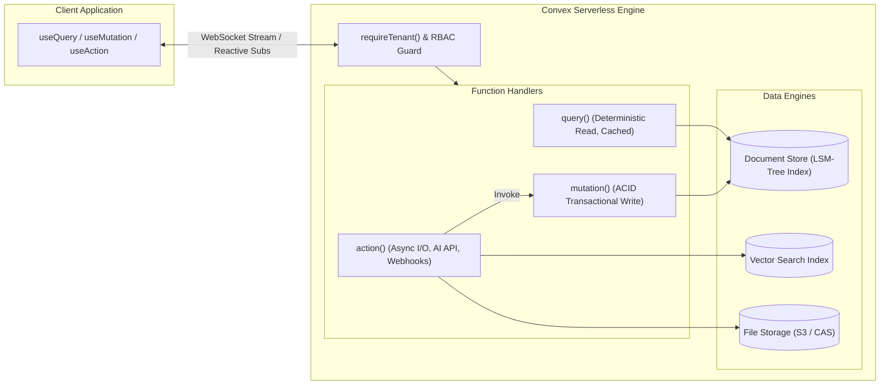

# Dokumentasi Arsitektur Lengkap Sistem (Hercules.ai Enterprise Platform)

Dokumen ini menyajikan arsitektur lengkap dari codebase enterprise bawaan **Hercules.ai**, mencakup seluruh struktur proyek, fitur-fitur fungsional, daftar tabel database, arsitektur backend Convex, tech stack, statistik codebase, serta diagram arsitektur.

---

## 1. Ikhtisar & Pola Arsitektur (Architecture Overview)

Aplikasi ini mengusung arsitektur **Full-Stack Reactive Serverless & Multi-Tenant Enterprise Architecture**.



### Prinsip Utama Sistem:
1. **Strict Multi-Tenancy**: Setiap entitas data terikat secara ketat pada `organizationId`.
2. **Super Admin Isolation Guard**: Akses Super Admin diatur melalui mekanisme perizinan data kategoris (`reports`, `letters`, `finance`, `payroll`, dll.) melalui `superAdminDataAccess`.
3. **End-to-End Type Safety**: Menggunakan skema TypeScript otomatis dari `convex/_generated/dataModel.d.ts` dan `convex/_generated/api.d.ts`.
4. **Real-time Reactive Data**: UI otomatis terbarui saat database mengalami mutasi data tanpa perlu polling.

---

## 2. Struktur Proyek (Project Structure)

```
start-app/
├── convex/                          # Backend Serverless Logic (Convex)
│   ├── _generated/                  # Tipe TypeScript & runtime Convex yang digenerate otomatis
│   ├── feedback360/                 # Modul evaluasi performa 360 derajat
│   ├── lib/                         # Shared utilities, guard tenant, auth & limit helpers
│   ├── okr/                         # Modul Objectives & Key Results
│   ├── onboarding/                  # Modul orientasi karyawan baru
│   ├── orgAdvanced/                 # Modul 9-box grid, succession, headcount, & org planning
│   ├── payroll/                     # Modul penggajian, komponen gaji, & payslip
│   ├── recruitment/                 # Modul Applicant Tracking System (ATS) & kandidat
│   ├── training/                    # Modul Learning Management System (LMS) & gamifikasi
│   ├── schema.ts                    # Definisi 249 tabel database, indeks, & relasi
│   ├── crons.ts                     # Konfigurasi background scheduler & cron jobs
│   └── *.ts                         # Endpoints query & mutation per domain bisnis
├── src/                             # Frontend Application Layer (React + TypeScript)
│   ├── components/                  # Reusable UI & Application Components
│   │   ├── product-tour/            # Interactive guide & onboarding walkthroughs
│   │   ├── providers/               # Theme, Auth, & Convex Context Providers
│   │   └── ui/                      # Radix UI + Tailwind Design System components
│   ├── hooks/                       # Custom React Hooks
│   ├── lib/                         # Client-side helper functions & formatters
│   ├── pages/                       # Screen views & routing modules (78+ halaman bisnis)
│   ├── App.tsx                      # Root App Router & Global Providers
│   ├── main.tsx                     # React Entry Point
│   └── index.css                    # Tailwind CSS Design Tokens & Base Theme
├── docs/                            # Dokumentasi Teknis Sistem
├── public/                          # Static Assets & Icons
├── package.json                     # Dependency Manifest
└── vite.config.ts                   # Vite Build Configuration
```

---

## 3. Fitur-Fitur Sistem per Domain Bisnis

Codebase mencakup seluruh modul Enterprise Human Capital & Operations Platform:

### 1. Manajemen Organisasi & Kepegawaian (HR Core & Organization)
* **Direktori Karyawan & Profil Lengkap**: Data pribadi, histori jabatan, riwayat pendidikan, riwayat penghargaan, dan dokumen pegawai.
* **Struktur Organisasi Interaktif**: Diagram hierarki posisi, hubungan struktural, dan *Dotted Line Reporting*.
* **Manajemen Jabatan & Nomenklatur**: Kamus jabatan, grading, tingkat jabatan fungsional, dan direktori posisi.
* **Perencanaan Headcount & Skenario**: Simulasi restrukturisasi organisasi (*Org Scenario Planning*) dan analisis rentang kendali (*Span of Control*).
* **Onboarding & Offboarding**: Alur tugas otomatis untuk karyawan baru serta checklist terminasi, handover, dan *Exit Interview*.

### 2. Finance, Budget & Expense Management
* **Fund Requests & Multi-Tier Approval**: Pengajuan dana operasional dengan *Approval Engine* bertingkat dan monitoring SLA.
* **Expense Tracking & Reimbursement**: Pelaporan biaya pengeluaran, kebijakan limit (*Expense Policies*), dan bukti transaksi.
* **Cash Advances**: Permohonan uang muka dinas, rekonsiliasi saldo, dan penutupan pengajuan.
* **Audit Trail Keuangan**: Log audit detail mencatat semua delegasi approval, penolakan, revisi, dan pencairan dana.

### 3. Kinerja, Talent Management & 9-Box Grid
* **9-Box Talent Matrix**: Pemetaan matriks *Performance vs Potential* karyawan untuk kebutuhan suksesi.
* **Succession Planning**: Identifikasi kandidat penerus jabatan kunci dengan indikator kesiapan (*Readiness Levels*).
* **Individual Development Plan (IDP)**: Rencana pengembangan kompetensi individual terintegrasi target karier.
* **Performance Reviews & 360 Feedback**: Siklus penilaian berkala melibatkan *self-review*, rekan kerja, dan atasan.
* **Global Grading System (GGS)**: Penilaian bobot jabatan berdasarkan faktor evaluasi standar internasional.

### 4. OKR (Objectives and Key Results) & Isu Strategis
* **Hierarki OKR**: Pengelolaan objektif tingkat korporat, departemen, hingga individu.
* **Check-in Berkala & Key Result Tracking**: Pembaruan metrik capaian secara periodik dengan status *On Track*, *At Risk*, atau *Behind*.
* **Strategic Issues**: Manajemen isu strategis organisasi, mitigasi risiko, dan tindak lanjut.

### 5. Penggajian & Kompensasi (Payroll)
* **Komponen Gaji Fleksibel**: Pengaturan tunjangan tetap/variabel, lembur, bonus, dan potongan (BPJS/Pajak).
* **Struktur Gaji & Salary Bands**: Pengelompokan gaji berdasarkan level jabatan dan grade posisi.
* **Periode Payroll & Payslip**: Pemrosesan *bulk payroll* per periode dan pembuatan slip gaji digital.

### 6. Waktu, Kehadiran & Perjalanan Dinas
* **Presensi & Attendance**: Pencatatan jam masuk/pulang harian, lembur, dan rekap keterlambatan.
* **Cuti & Izin (Leave Management)**: Pengajuan cuti, perhitungan saldo cuti tahunan, dan alur persetujuan atasan.
* **Perjalanan Dinas (Travel Requests)**: Rencana itinerary, akomodasi, dan integrasi pengajuan biaya perjalanan dinas.

### 7. Training, LMS & Gamifikasi
* **Katalog Kursus & Materi Interaktif**: Pembelajaran modular, silabus, video, dokumen, dan kuis uji pemahaman.
* **Jalur Pembelajaran (Learning Paths)**: Kurikulum terstruktur sesuai jalur karier (*Career Tracks*).
* **Gamifikasi & Flashcards**: Modul latihan kilat (*Flashcards*), *Microlessons*, sertifikat digital otomatis, dan *Leaderboard*.
* **Mentorship & Peer Groups**: Program pendampingan mentor-mentee dan grup diskusi pembelajaran.
* **Anggaran & ROI Pelatihan**: Perhitungan efektivitas biaya training terhadap anggaran departemen.

### 8. Rekrutmen & Pelacakan Kandidat (ATS)
* **Job Postings**: Publikasi lowongan pekerjaan internal dan eksternal.
* **Applicant Pipeline**: Tahapan seleksi kandidat (*Screening, Interview, Offering, Hired/Rejected*).
* **Manajemen Interview**: Penjadwalan wawancara, form evaluasi pewawancara, dan rekap nilai kandidat.

### 9. E-Office, Tata Persuratan & Disposisi
* **Persuratan Masuk & Keluar**: Registrasi surat, penomoran otomatis dengan kode unit/klasifikasi, dan arsip digital.
* **Alur Approval & Tanda Tangan**: Verifikasi surat bertingkat dan tanda tangan elektronik.
* **Disposisi Surat**: Penerusan instruksi surat kepada pejabat/staf terkait dengan status tindak lanjut.

### 10. Employee Engagement, Well-being & Kolaborasi
* **Survei Keterikatan (Engagement & Pulse)**: Survei kepuasan berkala dan analisis tren mood/kesejahteraan kerja.
* **Penghargaan & Apresiasi**: Modul *Kudos/Recognitions* antar pegawai dan penganugerahan *Awards*.
* **Komunikasi Internal**: Forum diskusi, pengumuman resmi, polling perusahaan, dan ticketing bantuan internal.
* **Panggilan Video & Ruangan**: Integrasi Daily.co / Zoom Meetings dan pemesanan ruang rapat.

---

## 4. Daftar Lengkap Tabel Database (Convex - 249 Tabel)

Berikut adalah daftar seluruh tabel database yang didefinisikan dalam `convex/schema.ts` dikelompokkan berdasarkan domain:

### Master User, Akun & Keanggotaan (12 Tabel)
- `users`
- `userSettings`
- `userAuditLog`
- `rolePermissions`
- `roleRequests`
- `roleMenuSettings`
- `orgMenuOverrides`
- `userInvites`
- `tourProgress`
- `welcomePageContent`
- `superAdminDataAccess`
- `dataAccessAudit`

### Manajemen Organisasi, Jabatan & Struktur (25 Tabel)
- `departments`
- `teams`
- `teamMembers`
- `jobTitles`
- `jobRoles`
- `jobRoleSops`
- `jobRoleKpis`
- `kpiMeasurements`
- `orgChartPositions`
- `headcountPositions`
- `orgHistory`
- `dottedLineReports`
- `orgScenarios`
- `orgScenarioChanges`
- `orgScenarioApprovals`
- `positionLevels`
- `positionNomenclature`
- `positionDirectory`
- `positionTitulatures`
- `positionSections`
- `positionGrades`
- `positionNomenclatures`
- `positionTingkatJabatan`
- `positionTingkatJabatanFungsional`
- `directoryFields`

### Riwayat, Profil & Dokumen Karyawan (11 Tabel)
- `profileChangeRequests`
- `historyChangeRequests`
- `employeeEducation`
- `employeeTrainingHistory`
- `employeeOrganizationHistory`
- `employeePositionHistory`
- `employeeAwardHistory`
- `employeeSkills`
- `documents`
- `employeeDocuments`
- `dataAccessGrants`

### Kehadiran, Cuti & Perjalanan Dinas (7 Tabel)
- `attendanceRecords`
- `leaveRequests`
- `leaveBalances`
- `travelRequests`
- `travelItineraryItems`
- `rooms`
- `roomBookings`

### Finance, Expense & Fund Requests (18 Tabel)
- `fundRequests`
- `fundRequestApprovals`
- `fundCategories`
- `financeApprovalChains`
- `financeApprovalLevels`
- `financeApprovalDelegations`
- `financeRoleMappings`
- `financeAuditLog`
- `financeReports`
- `expenseReports`
- `expensePolicies`
- `expenseCategories`
- `cashAdvances`
- `paymentSettings`
- `bankAccounts`
- `subscriptionPayments`
- `invoices`
- `invoiceEmails`

### Manajemen Kinerja, Talent & Grading (25 Tabel)
- `performanceReviews`
- `talentCycles`
- `talentPlacements`
- `talentIdps`
- `talentIdpItems`
- `nineBoxAssessments`
- `successionPlans`
- `competencies`
- `competencyAssessments`
- `competencyCourses`
- `careerTracks`
- `careerLevels`
- `careerLevelCompetencies`
- `careerAssignments`
- `careerPaths`
- `careerPathLevels`
- `careerPathAssignments`
- `ggsCompanySizes`
- `ggsPositions`
- `ggsEvaluations`
- `ggsFactorScores`
- `ggsEvaluators`
- `ggsSalaryBands`
- `ggsEmployeeAssignments`
- `ggsGradeHistory`

### Evaluasi 360 Derajat (3 Tabel)
- `feedback360Cycles`
- `feedback360Reviews`
- `feedback360Reviewers`

### OKR & Isu Strategis (4 Tabel)
- `objectives`
- `keyResults`
- `okrCheckins`
- `strategicIssues`

### Payroll & Penggajian (5 Tabel)
- `payrollComponents`
- `employeeSalaryComponents`
- `payrollPeriods`
- `payslips`
- `payslipLines`

### Rekrutmen & ATS (7 Tabel)
- `jobPostings`
- `jobApplications`
- `recruitmentJobs`
- `candidates`
- `candidateApplications`
- `recruitmentNotes`
- `recruitmentInterviews`

### Training, LMS, Gamifikasi & Komunitas Pembelajaran (36 Tabel)
- `courses`
- `courseLessons`
- `courseEnrollments`
- `courseQuizzes`
- `courseQuizAttempts`
- `courseCertificates`
- `courseAssignments`
- `courseReviews`
- `lessonComments`
- `learningPaths`
- `learningPathCourses`
- `trainingSessions`
- `trainingSessionRegistrations`
- `learnerStats`
- `coursePrerequisites`
- `externalTrainings`
- `courseSkills`
- `courseBookmarks`
- `courseSurveys`
- `courseSurveyResponses`
- `trainingBudgets`
- `courseCosts`
- `courseBenefits`
- `trainingOutcomes`
- `microlessons`
- `microlessonCompletions`
- `flashcardDecks`
- `flashcards`
- `flashcardReviews`
- `mentorProfiles`
- `mentorships`
- `mentorshipSessions`
- `peerGroups`
- `peerGroupMembers`
- `peerGroupPosts`
- `peerGroupPostLikes`

### Tata Persuratan & E-Office (20 Tabel)
- `letters`
- `letterheads`
- `letterReads`
- `letterRecipients`
- `letterEmailJobs`
- `letterEmailQueue`
- `letterAttachments`
- `letterDispositions`
- `letterApprovals`
- `letterHistory`
- `letterArchiveAudit`
- `letterPrefixSequences`
- `letterAgendaSequences`
- `letterCompanyPrefixes`
- `letterCategoryPrefixes`
- `letterNumberConfigs`
- `letterMemoSettings`
- `letterSignatures`
- `letterApprovalTemplates`
- `letterContentTemplates`

### Komunikasi, Kolaborasi & Social Engagement (24 Tabel)
- `announcements`
- `announcementLikes`
- `announcementComments`
- `forumThreads`
- `forumReplies`
- `suggestions`
- `suggestionVotes`
- `tickets`
- `ticketComments`
- `galleryAlbums`
- `galleryPhotos`
- `recognitions`
- `recognitionReactions`
- `awards`
- `awardCongratulations`
- `polls`
- `pollVotes`
- `engagementSurveys`
- `engagementResponses`
- `wellnessCheckins`
- `pulseSurveys`
- `pulseResponses`
- `events`
- `eventRsvps`

### Obrolan, Rapat & Komunikasi Real-time (6 Tabel)
- `conversations`
- `directMessages`
- `messages`
- `callSessions`
- `callQuotaUsage`
- `zoomMeetings`

### Manajemen Proyek, Task & Wiki (6 Tabel)
- `projects`
- `tasks`
- `taskStatuses`
- `taskPriorities`
- `wikiSpaces`
- `wikiArticles`

### Onboarding Karyawan (5 Tabel)
- `onboardingTemplates`
- `onboardingEmployees`
- `onboardingTasks`
- `onboardingResources`
- `onboardingCheckins`

### Offboarding & Resignasi (6 Tabel)
- `resignationRequests`
- `offboardingChecklistTemplates`
- `offboardingCases`
- `offboardingTasks`
- `offboardingHandovers`
- `exitInterviews`

### Manajemen Aset & Kebijakan Perusahaan (4 Tabel)
- `assets`
- `assetAssignments`
- `policies`
- `policyAcknowledgments`

### AI Chatbot & Assistive AI (2 Tabel)
- `aiChatSessions`
- `aiChatMessages`

### BOD Executive & Risk Management (7 Tabel)
- `bodKpiReports`
- `bodDivisions`
- `bodRiskItems`
- `bodAuditFindings`
- `bodHseIncidents`
- `bodTabConfig`
- `bodDivisionKpi`

### Pengaturan Platform, Addon, Langganan & Kuota (18 Tabel)
- `promos`
- `promoRedemptions`
- `upgradeRequests`
- `trackCalculations`
- `featureAddons`
- `orgAddons`
- `addonPurchases`
- `seatPurchases`
- `seatAddonSettings`
- `orgLimitAlerts`
- `orgStorageUsage`
- `alertEmailSettings`
- `trialSettings`
- `siteSettings`
- `footerLinks`
- `dashboardSettings`
- `notifications`
- `notificationPreferences`

---

## 5. Arsitektur Backend Convex (Convex Architecture)



### Karakteristik Eksekusi Backend Convex:
* **ACID Transactions**: Setiap `mutation` dieksekusi secara terisolasi dan atomik.
* **Automatic Live Subscriptions**: Setiap `query` yang dipanggil klien langsung berlangganan update data tanpa setup WebSocket manual.
* **Scheduled Tasks & Crons**: Menggunakan `crons.ts` untuk pembersihan token trial, pengingat langganan, dan pembaruan snapshot metrik.

---

## 6. Tech Stack Lengkap

| Lapisan (Layer) | Teknologi / Pustaka | Keterangan |
| :--- | :--- | :--- |
| **Frontend Framework** | React 19.2.3, React DOM 19 | Core UI renderer |
| **Build & Tooling** | Vite 7.3.1, TypeScript 5.9.3 | Ultra-fast HMR & bundler |
| **Routing** | React Router DOM 7.13.0 | Client-side application router |
| **State & Data Fetching** | Convex React SDK 1.31.6, TanStack Query 5.90 | Reaktif & server state synchronization |
| **Styling & Design System** | Tailwind CSS v4, Radix UI Primitives, Lucide Icons | Accessible, responsive styling |
| **Animation & Transitions**| Motion (Framer Motion 12), Embla Carousel | Fluid UI animations |
| **Data Visualization** | Recharts 2.15.4 | Charts, Area, Bar, Pie & Radar charts |
| **Rich Text Editor** | Tiptap Editor Suite 3.22 (StarterKit, Tables, Link) | Document & wiki rich content editing |
| **Export & Document Gen** | jsPDF, jspdf-autotable, XLSX, PapaParse, Mammoth | PDF, Excel, CSV, & Word document generation |
| **Video & Communication** | @daily-co/daily-js 0.91, Zoom Meetings Webhooks | WebRTC video conferencing & room calls |
| **Backend & Database** | Convex Serverless Platform | Reaktif, serverless document & vector store |
| **Authentication** | @usehercules/auth, react-oidc-context | Enterprise OIDC Single Sign-On |
| **AI Integration** | OpenAI SDK 6.34 | Assistive chatbot & embedding search |

---

## 7. Statistik Codebase

* **Total Tabel Database (Convex Schema)**: **249 Tabel**
* **Total File Modul Backend (Convex)**: **197 File TypeScript**
* **Total File Frontend & Komponen (src)**: **746 File**
* **Total Halaman Aplikasi (Business Views)**: **78+ Halaman**
* **Model Multi-Tenancy**: Organization-Scoped Multi-Tenant dengan Super Admin Protection Guard
