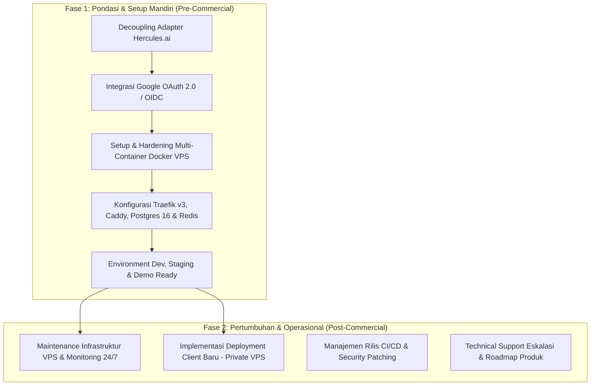
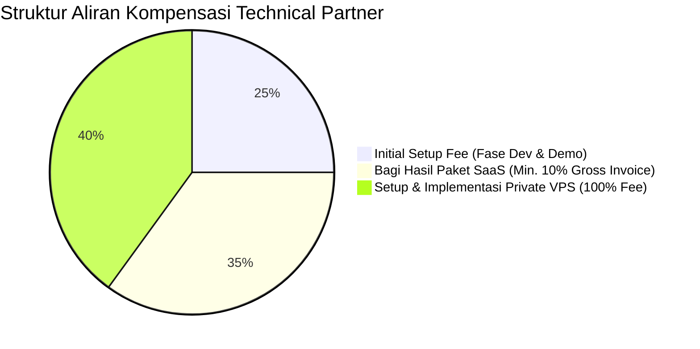
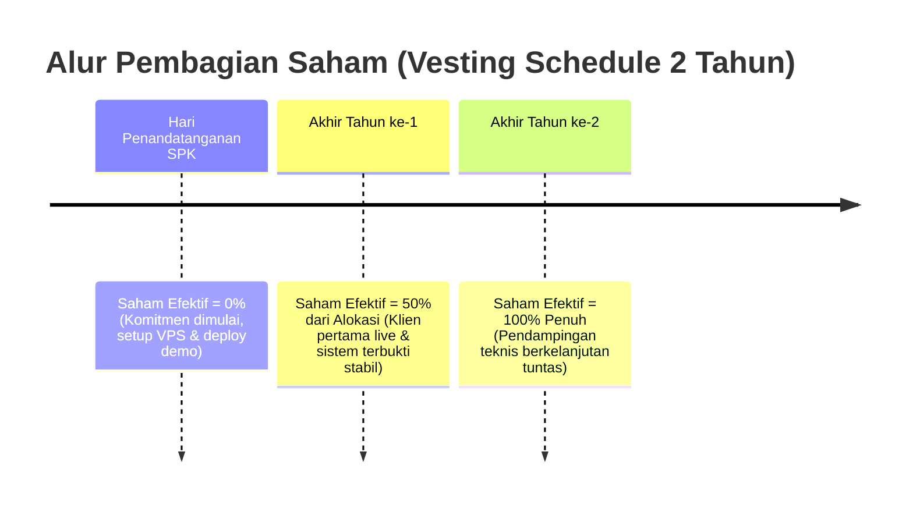
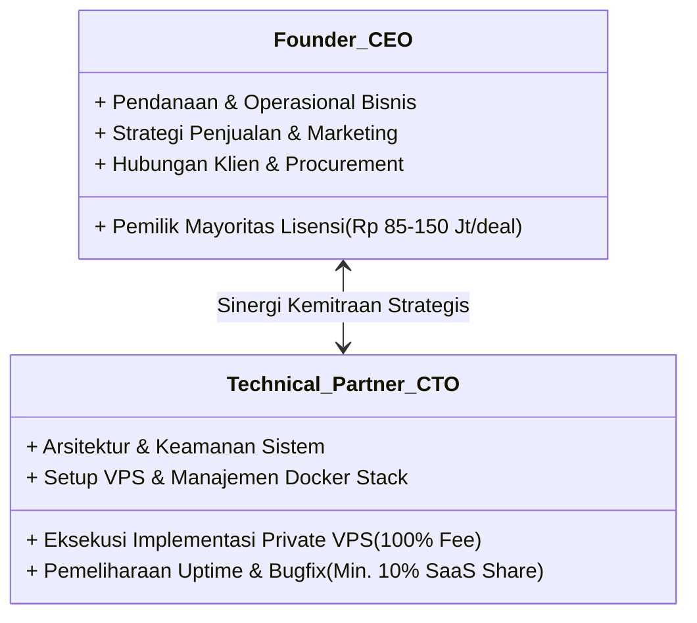

# Proposal Perjanjian Kerjasama Kemitraan Teknis Strategis (Technical Partner / Fractional CTO)

**Dokumen Penawaran Kerjasama Jangka Panjang & Model Kompensasi**  
**Peran**: Technical Partner / Chief Technology Officer (CTO)  
**Tujuan**: Pengawalan Arsitektur, Migrasi Mandiri, Stabilitas Infrastruktur VPS, dan Skalabilitas Produk Komersial

---

## 1. Latar Belakang & Visi Kemitraan (Partnership Vision)

Pengembangan dan komersialisasi platform enterprise berskala besar (249 tabel database, 10 modul terintegrasi, dan arsitektur real-time reaktif) membutuhkan kepemimpinan teknis yang stabil, andal, dan memiliki kepemilikan visi (*long-term commitment*).

Kemitraan ini dirancang bukan sekadar hubungan vendor lepas (*freelance/outsource*), melainkan **Kemitraan Strategis Jangka Panjang (Technical Partner / CTO)**. Model ini menyelaraskan insentif antara pemilik bisnis (Founder/CEO) dan pemimpin teknologi (CTO) untuk bersama-sama membangun produk yang stabil, mengawal deployment mandiri di VPS, serta memonetisasi platform secara agresif dan berkelanjutan di pasar Indonesia.

---

## 2. Ruang Lingkup Pekerjaan & Tanggung Jawab (Scope of Work & Roles)

Sebagai Technical Partner / CTO, ruang lingkup pekerjaan dibagi menjadi **Fase Awal (Pondasi & Migrasi)** dan **Fase Berjalan (Operasional Komersial & Skalabilitas)**:

### Rincian Tanggung Jawab CTO:

| Kategori Pekerjaan | Detail Aktivitas & Deliverables |
| :--- | :--- |
| **1. Refactoring & Adapter Penyelarasan** | • Menyelaraskan 5 file adapter autentikasi dari ekosistem Hercules.ai ke Google OIDC standar. • Memastikan keutuhan 249 tabel database Convex, seluruh query reaktif, dan 78+ halaman frontend tanpa error. |
| **2. Infrastruktur & Keamanan VPS** | • Orkestrasi Docker Compose (Traefik v3 auto-SSL, Caddy static SPA, Convex engine, PostgreSQL 16 persistence, Redis 7, dan Async Worker). • Hardening keamanan (Rate limiting Traefik, isolasi port internal database, firewall UFW). • Otomasi backup harian database (`pg_dump`) dan sinkronisasi file storage lokal. |
| **3. Pipeline CI/CD & Lingkungan Demo** | • Membangun pipeline GitHub Actions otomatis: branch `dev` untuk staging testing dan Git Tag `v*` untuk rilis produksi zero-downtime. • Menyiapkan instance server Demo yang stabil dan selalu siap digunakan tim sales untuk presentasi ke calon klien. |
| **4. Onboarding & Implementasi Klien** | • Melakukan deployment khusus untuk klien dengan skema Private VPS / On-Premise. • Setup domain klien, konfigurasi SSL, dan pendampingan technical go-live. |
| **5. Strategic Technology Leadership** | • Mengawal keputusan arsitektur sistem, efisiensi beban server, dan audit keamanan berkala. |

---

## 3. Struktur Kompensasi & Skema Bagi Hasil (Compensation Model)

Struktur kompensasi diselaraskan langsung dengan **Dokumen Proposal Komersial (`docs/PRODUCT_PROPOSAL_INDONESIA.md`)**, mencakup **Initial Setup Tunai di Awal**, **Bagi Hasil Langganan Paket SaaS (Min. 10%)**, dan **100% Fee Jasa Setup/Implementasi Private VPS**:

---

### A. Kompensasi Awal: Initial Setup & Migration Fee (Pre-Commercial Phase)
* **Status Proyek**: Tahap persiapan sistem, migrasi mandiri ke VPS, dan penyediaan server Development & Demo untuk kebutuhan tim bisnis sebelum produk dijual ke publik.
* **Nilai Kompensasi Tunai (Cash)**: **Rp 15.000.000 – Rp 20.000.000** *(One-Time)*.
* **Skema Pembayaran**:
  - **DP 50% (Rp 7.500.000 – Rp 10.000.000)**: Dibayarkan saat penandatanganan kesepakatan kerjasama untuk memulai konfigurasi server dan refactoring adapter.
  - **Pelunasan 50% (Rp 7.500.000 – Rp 10.000.000)**: Dibayarkan setelah sistem berhasil live di VPS mandiri, pipeline CI/CD aktif, dan server Demo siap pakai untuk tim bisnis.

---

### B. Kompensasi Berkelanjutan: Skema Langganan Paket SaaS (Min. 10% Recurring Share)
* **Ketentuan**: Setiap kali tim bisnis berhasil menjual **Paket Langganan SaaS (Growth, Business, atau Enterprise)**, Technical Partner berhak atas bagi hasil minimal **10% dari Nilai Kotor Invoice Kontrak Klien** (bulanan atau tahunan di luar PPN).

#### Simulasi Pendapatan Berdasarkan Paket Penjualan Proposal:

| Paket Klien (Sesuai Proposal) | Profil Klien & Model Kontrak | Nilai Invoice Kontrak Klien | Hak Kompensasi CTO (**10% Recurring Share**) |
| :--- | :--- | :--- | :--- |
| **1 Klien Growth Plan** | Perusahaan 100 Karyawan (@Rp 17.500/bln) *Kontrak Tahunan (Diskon 15%)* | **Rp 17.850.000** / tahun | **Rp 1.785.000** / tahun per klien |
| **1 Klien Business Plan** | Perusahaan 300 Karyawan (@Rp 14.500/bln) *Kontrak Tahunan (Diskon 15%)* | **Rp 44.370.000** / tahun | **Rp 4.437.000** / tahun per klien |
| **1 Klien Enterprise SaaS** | Korporasi 1.000 Karyawan (@Rp 11.500/bln) *Kontrak Tahunan (Diskon 15%)* | **Rp 117.300.000** / tahun | **Rp 11.730.000** / tahun per klien |

#### Simulasi Akumulasi Portofolio SaaS Tahunan:
* **Jika Ada 10 Klien Campuran** (e.g. 5 Growth + 4 Business + 1 Enterprise):
  - Total Omzet Kontrak Tahunan Masuk: **~Rp 384.000.000 / tahun**.
  - **Hak Bagi Hasil Technical Partner (10%)**: **Rp 38.400.000 / tahun** *(Diterima proporsional sesuai termin pembayaran klien)*.
* **Tanggung Jawab CTO atas Bagian Ini**: Memastikan *uptime 99.9%*, manajemen database, tuning WebSocket, update patch rilis minor, dan penanganan insiden teknis.

---

### C. Kompensasi Proyek: Skema Private VPS / On-Premise Client
* **Ketentuan**: Jika klien (BUMN, Korporasi Besar, Institusi) memilih skema **Private VPS Deployment / Perpetual License** (Skema B pada Proposal Bisnis), maka **100% Nilai Jasa Setup & Implementasi Teknis menjadi hak Technical Partner**.

#### Distribusi Pendapatan Deal Private VPS:

| Komponen Invoice Klien (Sesuai Proposal) | Nilai Standar Proposal | Pihak yang Menerima |
| :--- | :--- | :--- |
| **1. Lisensi Software (Perpetual License)** | Rp 85.000.000 – Rp 150.000.000 | **100% Milik Founder / Perusahaan Bisnis** |
| **2. Implementation & Setup Fee VPS** | **Rp 25.000.000 – Rp 40.000.000** | **100% Hak Milik Technical Partner (CTO)** |
| **3. User Training & Change Management** | Rp 15.000.000 | Founder / Tim Trainer Bisnis |
| **4. Annual Maintenance Contract (AMC)** | 15% – 20% per tahun | **Bagi Hasil 50% : 50%** (Support & Update) |

#### Penjelasan:
* Technical Partner memegang tanggung jawab teknis penuh dalam menyiapkan instance VPS baru milik klien, instalasi multi-container Docker, setup domain/SSL klien, migrasi data awal, dan integrasi Google SSO klien hingga *Go-Live*.
* Oleh karena itu, seluruh biaya jasa implementasi yang ditagihkan ke klien (**Rp 25 Juta – Rp 40 Juta per deal baru**) langsung masuk sebagai kompensasi eksekusi teknis Technical Partner.

---

## 4. Opsi Kepemilikan Ekuitas / Saham & Mekanisme Vesting (Equity Alignment)

Sebagai pengikat komitmen jangka panjang (*Skin in the Game*):
* **Alokasi Ekuitas**: **10% – 12% Saham Kosong / Sweat Equity**.
* **Struktur Kepemilikan**:
  - **Founder / CEO**: **88% – 90%** (Pemegang Kendali & Kebijakan Bisnis Utama).
  - **Technical Partner / CTO**: **10% – 12%** (Pemegang Kebijakan & Arsitektur Teknologi).

---

### Penjelasan Detail Mekanisme Vesting (2 Tahun)

**Vesting** adalah mekanisme standar industri teknologi di mana hak kepemilikan saham **tidak diberikan secara langsung di hari pertama**, melainkan **diperoleh secara bertahap berdasarkan waktu dan pencapaian target kerja nyata (*milestone triggers*)**.

#### A. Tujuan & Prinsip Perlindungan Bisnis
1. **Melindungi Founder & Bisnis Utama**: Mencegah skenario di mana partner teknis diberi saham di awal tetapi tidak aktif atau berhenti di tengah jalan, namun tetap menguasai saham perusahaan secara permanen.
2. **Menjamin Akuntabilitas Kinerja**: Memastikan saham hanya menjadi milik partner jika produk benar-benar terbukti berjalan stabil dan menghasilkan traksi komersial bagi bisnis.

#### B. Rincian Jadwal Vesting Bertahap (Contoh Alokasi 10% Saham):

1. **Tahun ke-1 (50% Terbuka / 5% Saham Efektif)**:
   - **Syarat Pembukaan (Triggers)**:
     - Technical Partner berhasil menyelesaikan migrasi mandiri ke VPS dan memelihara server Demo.
     - Tim bisnis berhasil mendapatkan **klien berbayar pertama** (*First Paying Client*).
     - Sistem terbukti beroperasi stabil (SLA uptime tercapai dan tidak ada kendala fatal yang terbengkalai) selama 1 tahun pertama.
   - **Hak yang Diperoleh**: Technical Partner resmi memegang **5% saham** perusahaan.

2. **Tahun ke-2 (50% Sisanya Terbuka / Total 10% Saham Penuh)**:
   - **Syarat Pembukaan (Triggers)**:
     - Technical Partner tetap aktif menjalankan peran CTO sepanjang tahun kedua (mengelola server, update keamanan, membantu deployment klien baru, dan eskalasi teknis).
   - **Hak yang Diperoleh**: Saham terbuka penuh menjadi **10% (100% Fully Vested)**.

#### C. Simulasi Skenario Keberlanjutan Kemitraan:

| Skenario Operasional di Lapangan | Status Saham CTO | Dampak Finansial & Legal bagi Founder |
| :--- | :--- | :--- |
| **Skenario A: Partner Mundur di Bulan ke-4** *(Sebelum ada klien / belum 1 tahun)* | **0% Saham** *(Hangus Total)* | **Aman 100%**: Founder tidak kehilangan ekuitas sepeser pun karena syarat tahun ke-1 belum terpenuhi. |
| **Skenario B: Partner Aktif 1 Tahun, Lalu Berhenti di Tahun ke-2** | **5% Saham Saja** *(Hanya porsi tahun ke-1)* | Sisa 5% yang belum vested otomatis kembali ke Founder. Partner hanya memiliki porsi atas kontribusi tahun ke-1 yang sudah terbukti. |
| **Skenario C: Partner Aktif Penuh Selama 2 Tahun & Seterusnya** | **10% Saham Penuh** | Sinergi ideal: Produk sudah matang, stabil di pasar, dan kemitraan berjalan jangka panjang. |

---

## 5. Ringkasan Hak & Kewajiban Para Pihak

### A. Hak & Kewajiban Founder / CEO:
1. Memiliki hak penuh atas arah kebijakan komersial, penetapan harga jual, dan strategi branding produk.
2. Bertanggung jawab atas biaya operasional server (sewa VPS pihak ketiga, domain, lisensi tools eksternal).
3. Bertanggung jawab atas penjualan, pemasaran, negosiasi kontrak dengan calon klien, dan penagihan invoice.
4. Menyalurkan hak kompensasi Technical Partner sesuai termin dan realisasi pembayaran klien secara tepat waktu.

### B. Hak & Kewajiban Technical Partner / CTO:
1. Bertanggung jawab penuh atas kelancaran teknis, ketersediaan server demo, serta eksekusi migrasi awal.
2. Memastikan seluruh deployment klien (SaaS maupun Private VPS) berjalan sesuai standar keamanan dan SLA.
3. Berhak menerima uang muka setup awal, bagi hasil minimal 10% atas klien SaaS, dan 100% fee implementasi VPS per klien baru.
4. Memberikan asistensi teknis saat tim sales membutuhkan dukungan teknis mendalam dalam proses tender/presentasi klien enterprise.

---

## 6. Pengesahan & Langkah Selanjutnya

Dokumen ini disusun sebagai dasar penyusunan **Surat Perjanjian Kerjasama Kemitraan (Partnership Agreement)** resmi.

**Langkah Eksekusi Segera**:
1. Penandatanganan dokumen kesepakatan kemitraan dan pencairan DP Setup Awal (50%).
2. Penerimaan akses VPS server mandiri dan repository Git.
3. Memulai proses refactoring adapter Google OAuth dan deployment multi-container Docker.
4. Penyerahan server Demo yang siap digunakan untuk demonstrasi ke calon konsumen.
