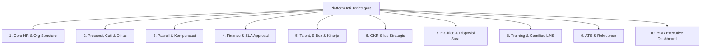
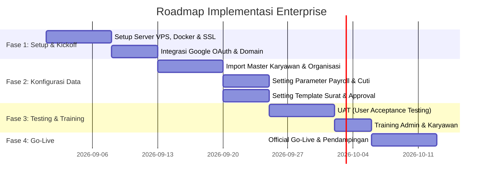

# Proposal Penawaran Solusi: Sistem Informasi Manajemen SDM & Operasional Terpadu (Enterprise HCM & E-Office Platform)

**Dokumen Penawaran Komersial & Solusi Bisnis**  
**Sasaran Klien**: Perusahaan Swasta, BUMN, Multi-Branch Enterprise, & Institusi di Indonesia  
**Disusun Oleh**: Product Owner / Enterprise Solution Specialist

---

## 1. Executive Summary & Value Proposition

Di era transformasi digital, efisiensi operasional dan tata kelola perusahaan yang transparan adalah kunci daya saing. Banyak korporasi di Indonesia menghadapi tantangan fragmentasi sistem: absensi terpisah, penggajian manual di spreadsheet, pengajuan dana (*fund requests*) yang lambat, persuratan fisik yang menumpuk, serta evaluasi talenta yang belum terintegrasi.

Platform ini hadir sebagai **All-in-One Enterprise Platform (Human Capital Management + E-Office + Financial Governance)** yang menggabungkan **10 modul bisnis terintegrasi**, didukung arsitektur **Real-Time Reactive** berbasis standar industri.

### Nilai Tambah Utama (Key Business Values):
* **Efisiensi Waktu Approval hingga 70%**: Alur persetujuan keuangan bertingkat, cuti, dan disposisi surat dilakukan secara real-time via web/mobile dengan SLA tracking.
* **Akurasi Penggajian 100%**: Payroll otomatis terintegrasi dengan data presensi, lembur, pinjaman, dan potongan regulasi di Indonesia (BPJS Ketenagakerjaan, BPJS Kesehatan, PPh 21).
* **Keputusan Talenta Berbasis Data**: Pemetaan talenta standar korporasi menggunakan metode *9-Box Grid Matrix*, *Individual Development Plan (IDP)*, dan evaluasi *360-Degree Feedback*.
* **Keamanan & Kedaulatan Data**: Dapat di-deploy secara **On-Premise / Private VPS Mandiri**, menjamin data sensitif perusahaan tetap berada di bawah kendali penuh internal.

---

## 2. Cakupan Solusi & Modul Aplikasi (Feature Matrix)

### Rincian 10 Modul Utama:

| Modul | Fitur Utama | Dampak bagi Perusahaan |
| :--- | :--- | :--- |
| **1. Core HR & Struktur Organisasi** | Direktori pegawai lengkap, bagan organisasi interaktif, manajemen jabatan/grading, dotted-line reporting, onboarding & offboarding otomatis. | Database karyawan terpusat, eliminasi duplikasi data kepegawaian. |
| **2. Presensi, Cuti & Travel** | Catat kehadiran real-time, pengajuan cuti berjenjang, reimbursement dinas, dan reservasi ruang rapat. | Disiplin kerja terpantau transparan, kalkulasi absensi instan. |
| **3. Payroll & Kompensasi** | Struktur gaji fleksibel, potongan BPJS & PPh 21, pembuatan slip gaji digital otomatis, rekap payroll periodik. | Proses tutup buku gaji bulanan selesai dalam hitungan jam. |
| **4. Finance & Approval SLA** | Multi-level Fund Requests, Cash Advance, pelaporan Expense, pelacakan SLA approval, dan audit log finansial. | Pengendalian anggaran ketat dan mitigasi risiko fraud keuangan. |
| **5. Talent Management & 9-Box** | Matriks 9-Box (Performance vs Potential), suksesi jabatan kunci, Global Grading System (GGS), evaluasi 360°. | Perencanaan kaderisasi pemimpin masa depan yang terukur. |
| **6. OKR & Strategic Issues** | Manajemen Key Results tingkat perusahaan/divisi, check-in progres berkala, pelacakan isu strategis. | Penyelarasan target bisnis dari jajaran direksi hingga staf. |
| **7. E-Office & Tata Persuratan** | Registrasi surat masuk/keluar, penomoran otomatis multi-kode, tanda tangan elektronik, dan disposisi berjenjang. | Paperless office, penelusuran surat resmi cepat dan aman. |
| **8. Training & LMS Gamifikasi** | Katalog kursus, jalur belajar (*Learning Paths*), kuis, flashcards, sertifikat otomatis, dan analisis ROI training. | Peningkatan kompetensi karyawan yang terpantau perkembangannya. |
| **9. Rekrutmen & ATS** | Publikasi lowongan, pipeline pelamar (*Applicant Tracking*), jadwal interview, form evaluasi kandidat. | Proses rekrutmen lebih terstruktur dan hemat biaya agen. |
| **10. BOD Executive Dashboard** | Ringkasan KPI korporat, matriks risiko, status temuan audit, indikator HSE, dan laporan analitik eksekutif. | Visibilitas penuh bagi jajaran direksi dalam mengambil keputusan. |

---

## 3. Model Lisensi & Skema Penawaran Harga (Pricing Model)

Kami menawarkan dua skema fleksibel yang disesuaikan dengan skala dan model belanja perusahaan (CAPEX vs OPEX):

### Skema A: Subscription / SaaS (OPEX Model)
*Cocok untuk perusahaan berkembang yang menginginkan fleksibilitas biaya bulanan/tahunan.*

| Paket | Rentang Headcount | Biaya per User / Bulan | Total Investasi Tahunan (Diskon 15%) | Fitur & Layanan |
| :--- | :--- | :--- | :--- | :--- |
| **Growth Plan** | 50 – 200 Karyawan | **Rp 17.500** / user / bln | ~Rp 8.900.000 – Rp 35.700.000 / thn | • Modul HR Core, Presensi, Cuti, E-Office, Payroll Dasar. • Cloud Hosting Terkelola. • SLA Support Jam Kerja (8x5). |
| **Business Plan** | 201 – 500 Karyawan | **Rp 14.500** / user / bln | ~Rp 29.500.000 – Rp 73.900.000 / thn | • Seluruh modul Growth + Finance SLA, OKR, Training LMS. • Integrasi Google SSO / OAuth. • Dedicated Customer Success Manager. |
| **Enterprise SaaS** | 501 – 2.000+ Karyawan | **Rp 11.500** / user / bln | Kustom sesuai volume user | • **Seluruh 10 Modul Lengkap** (Termasuk 9-Box & BOD Dashboard). • Custom Domain & Private Database Instance. • Priority Support 24x7 dengan SLA 99.9%. |

---

### Skema B: Private VPS Deployment / One-Time License + Support (CAPEX Model)
*Sangat direkomendasikan untuk korporasi, institusi, atau BUMN yang mewajibkan data tersimpan di server mandiri / on-premise.*

| Komponen Investasi | Keterangan & Deliverables | Nilai Investasi (IDR) |
| :--- | :--- | :--- |
| **1. Perpetual Software License (Enterprise)** | • Lisensi penggunaan sistem penuh (**10 Modul Lengkap**). • Hak instalasi pada Private VPS / On-Premise Server mandiri. • Bebas penambahan user tanpa batasan (*Unlimited Users*). | **Rp 85.000.000 – Rp 150.000.000** *(One-Time)* |
| **2. Implementation & Setup Fee** | • Instalasi container stack (Traefik, Caddy, Convex, PostgreSQL, Redis). • Setup Google Cloud OAuth 2.0 / SSO. • Migrasi data awal master karyawan & konfigurasi master data (jabatan, cuti, payroll). • Konfigurasi alur persetujuan & template persuratan. | **Rp 25.000.000 – Rp 40.000.000** *(One-Time)* |
| **3. Training & Change Management** | • Pelatihan Admin HR & Finance (2 Hari). • Pelatihan Pengguna & Manager (1 Hari). • Buku panduan operasional & rekaman video training. | **Rp 15.000.000** *(One-Time)* |
| **4. Annual Maintenance & Support (Tahun ke-2 dst.)** | • Pembaruan patch keamanan & kompatibilitas sistem. • Bantuan teknis prioritas (L1–L3 Support). • Backup monitoring harian dan inspeksi performa berkala. | **15% – 20%** dari nilai lisensi per tahun *(Gratis di Tahun ke-1)* |

---

## 4. Analisis Return on Investment (ROI) & Efisiensi Biaya

Perbandingan estimasi biaya operasional perusahaan skala **300 Karyawan**:

| Aspek Operasional | Biaya Cara Lama (Manual / Sistem Terpisah) | Menggunakan Platform Terpadu Ini | Penghematan per Tahun |
| :--- | :--- | :--- | :--- |
| **Langganan Aplikasi Terpisah** | Rp 120.000.000 / thn *(Aplikasi Absensi terpisah + E-Sign terpisah + LMS terpisah)* | Rp 52.200.000 / thn *(Terpadu di 1 platform)* | **Rp 67.800.000** |
| **Biaya Kertas & Cetak Surat (ATK)** | Rp 36.000.000 / thn *(Kertas surat, memo, amplop, kurir)* | Rp 3.600.000 / thn *(Paperless E-Office)* | **Rp 32.400.000** |
| **Waktu Produktivitas Tim HR & Finance** | ~40 Jam kerja per bulan terbuang untuk rekap manual | Otomatisasi data real-time | **Efisiensi ~480 Jam Kerja / thn** |
| **TOTAL PENGHEMATAN BIAYA TAHUNAN** | | | **~Rp 100.200.000+ / Tahun** |

---

## 5. Rencana Tahapan Implementasi (Rollout Roadmap)

Implementasi dirancang selesai dalam waktu **4 hingga 6 Minggu**:

---

## 6. Standar Layanan Dukungan (Service Level Agreement - SLA)

Untuk menjamin kelancaran operasional perusahaan:
* **Uptime Guarantee**: **99.9%** ketersediaan sistem.
* **Kategori Respon Insiden**:
  - **Kritis (Sistem Down)**: Respon < 30 Menit, Target Solusi < 4 Jam.
  - **Tinggi (Fitur Utama Terkendala)**: Respon < 2 Jam, Target Solusi < 8 Jam.
  - **Normal (Pertanyaan / Bantuan Teknis)**: Respon < 4 Jam.
* **Channel Komunikasi**: Dedicated WhatsApp Group Support, Email Ticketing, & Remote Desktop Session.

---

## 7. Penutup & Langkah Selanjutnya

Platform ini bukan sekadar software, melainkan investasi strategis untuk meningkatkan tata kelola (*governance*), efisiensi finansial, dan produktivitas karyawan perusahaan Anda.

**Langkah Selanjutnya**:
1. **Sesi Demo Interaktif**: Demonstrasi alur kerja 10 modul utama secara langsung kepada tim manajemen Anda.
2. **Kajian Kebutuhan Data (Data Assessment)**: Pemetaan data awal kepegawaian dan struktur persetujuan yang sedang berjalan.
3. **Penerbitan Surat Penawaran Resmi (Quotation)** & Penandatanganan Kontrak Kerjasama.
