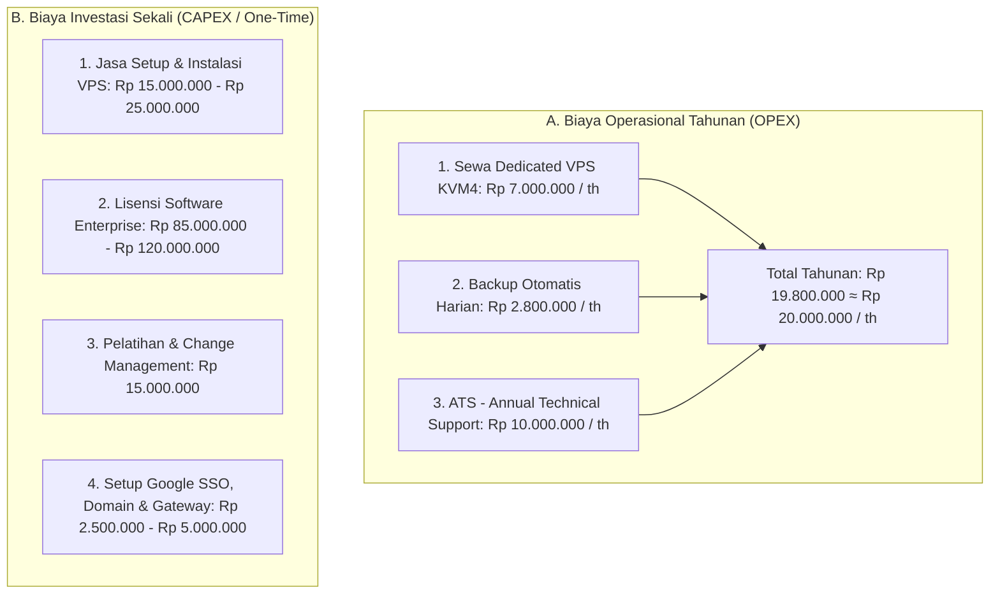

# Rencana Anggaran Biaya (RAB) & Proposal Investasi: 1 Perusahaan dengan 1 Dedicated VPS

**Dokumen Analisa & Estimasi Biaya Implementasi Sistem Mandiri (Private VPS)**  
**Target Pengguna**: 1 Entitas Perusahaan / Korporasi Mandiri  
**Arsitektur**: Dedicated KVM VPS Multi-Container (Traefik v3, Caddy, Convex Backend, PostgreSQL 16, Redis 7, BullMQ Worker)

---

## 1. Ringkasan Eksekutif Anggaran Biaya

Estimasi investasi dibagi menjadi dua kategori pembiayaan:
1. **Biaya Operasional Tahunan (OPEX)**: Pemeliharaan infrastruktur server, backup otomatis, dan dukungan teknis (*Annual Technical Support*).
2. **Biaya Investasi Satu Kali (CAPEX / One-Time)**: Biaya lisensi software, jasa instalasi/setup VPS, migrasi data awal, dan pelatihan pengguna.



---

## 2. Rincian & Koreksi Biaya Tahunan (OPEX)

| No | Komponen Biaya | Perhitungan & Asumsi | Estimasi Biaya (IDR) | Keterangan & Spesifikasi |
| :--- | :--- | :--- | :--- | :--- |
| **1** | **Sewa Dedicated VPS KVM4** | $29 × 12 bulan × 1.11 (PPN 11%) = $386.28<br>*(Kurs buffer $1 = Rp 18.000)* | **Rp 6.953.040**<br>*(Dibulatkan **Rp 7.000.000 / th**)* | **Spesifikasi**: 4 vCPU, 16 GB RAM, 200 GB NVMe SSD, 1 Gbps Bandwidth. Cukup untuk melayani 100–1.000+ pengguna aktif real-time. |
| **2** | **Backup Otomatis Harian & Storage Offsite** | Rp 209.000 × 12 bulan × 1.11 (PPN 11%) = Rp 2.783.880 | **Rp 2.783.880**<br>*(Dibulatkan **Rp 2.800.000 / th**)* | Snapshot otomatis harian level VPS + dumping database PostgreSQL harian (`pg_dump`) dan sinkronisasi file dokumen/lampiran ke offsite storage terpisah. |
| **3** | **Biaya ATS (Annual Technical Support)** | 1 tahun kontrak pemeliharaan & dukungan teknis | **Rp 10.000.000 / th** | • Jaminan SLA Uptime 99.9%.<br>• Pembaruan patch keamanan OS & Docker stack.<br>• Pemantauan performa database & alokasi memori.<br>• Penanganan insiden kritis (< 4 jam). |
| **TOTAL** | **Estimasi Biaya Operasional Tahunan** | | **Rp 19.800.000 / th**<br>*(Dibulatkan **Rp 20.000.000 / th**)* | **Estimasi perhitungan Anda sudah tepat dan akurat.** |

---

## 3. Rincian & Koreksi Biaya Sekali (CAPEX / One-Time)

### A. Koreksi Poin Pengembangan Awal
> [!IMPORTANT]
> **Koreksi Arsitektur & Bisnis**:
> Platform sistem ini **sudah selesai dibangun** (mencakup 10 modul lengkap dan 249 tabel database terintegrasi). Klien **tidak perlu menanggung biaya riset/koding dari nol**, melainkan dialokasikan ke dalam **Lisensi Software (Perpetual)** dan **Jasa Setup / Onboarding**.

### B. Tabel Rincian Biaya Sekali di Awal:

| No | Komponen Biaya Sekali | Estimasi Nilai (IDR) | Rincian Pekerjaan & Deliverables |
| :--- | :--- | :--- | :--- |
| **1** | **Biaya Setup & Instalasi VPS Awal** | **Rp 15.000.000 – Rp 25.000.000** | • Instalasi OS Linux & hardening firewall (UFW/Fail2ban).<br>• Orkestrasi Docker Compose (Traefik v3, Caddy, Convex Backend, PostgreSQL 16, Redis 7, BullMQ Worker).<br>• Konfigurasi SSL/TLS otomatis Let's Encrypt.<br>• Konfigurasi pipeline CI/CD GitHub Actions untuk update otomatis zero-downtime. |
| **2** | **Lisensi Software Enterprise (Perpetual)** | **Rp 85.000.000 – Rp 120.000.000** | • Hak penggunaan penuh 10 modul sistem tanpa batasan user (*Unlimited Users*).<br>• Kepemilikan database mandiri di dalam server perusahaan (*Data Sovereignty*). |
| **3** | **Onboarding Data & Konfigurasi Master** | **Rp 10.000.000 – Rp 15.000.000** | • Import data master karyawan, jabatan, departemen, dan saldo cuti awal.<br>• Setting formula payroll (BPJS Ketenagakerjaan, BPJS Kesehatan, PPh 21, tunjangan, lembur).<br>• Setting alur persetujuan bertingkat (*Approval SLA*) dan template surat dinas. |
| **4** | **Pelatihan & Change Management (Training)** | **Rp 15.000.000** | • Pelatihan Admin HR & Finance (2 Hari).<br>• Pelatihan Pengguna & Manager (1 Hari).<br>• Dokumentasi buku manual operasional & rekaman video panduan. |
| **5** | **Integrasi Google SSO, Domain & Gateway Notifikasi** | **Rp 2.500.000 – Rp 5.000.000** | • Setup & verifikasi Google Cloud Console OAuth 2.0 / OIDC.<br>• Konfigurasi DNS domain resmi perusahaan (`app.perusahaan.co.id`).<br>• Setup SMTP relay email transaksional & gateway notifikasi WhatsApp. |

---

## 4. Opsi Skema Paket Investasi untuk Klien

Untuk fleksibilitas anggaran klien, penawaran dapat diajukan dalam 2 opsi paket:

```text
========================================================================================
OPSI 1: PAKET LENGKAP MANDIRI (PERPETUAL LICENSE + SETUP VPS DEDICATED)
========================================================================================
1. Biaya Sekali di Awal (Tahun ke-1):
   - Lisensi Software Enterprise (10 Modul Lengkap)        : Rp  85.000.000
   - Setup, Instalasi VPS, Docker Stack & CI/CD            : Rp  20.000.000
   - Onboarding Data Karyawan & Setting Payroll            : Rp  10.000.000
   - Pelatihan Pengguna (Training & User Manual)           : Rp  15.000.000
   - Setup Google SSO, Domain & Gateway Notifikasi         : Rp   2.500.000
   - Sewa VPS Dedicated + Backup Harian (Tahun ke-1)       : Rp   9.800.000
   - ATS / Technical Support (Tahun ke-1)                  : GRATIS (Included)
   -------------------------------------------------------------------------------------
   TOTAL INVESTASI TAHUN KE-1                              : Rp 142.300.000 (One-Time CAPEX)

2. Biaya Operasional Rutin (Mulai Tahun ke-2 dst):
   - Sewa Dedicated VPS KVM4 (16GB RAM / 200GB SSD)        : Rp   7.000.000 / tahun
   - Backup Otomatis Harian & Offsite Storage              : Rp   2.800.000 / tahun
   - ATS / Annual Technical Support (SLA 99.9%)            : Rp  10.000.000 / tahun
   -------------------------------------------------------------------------------------
   TOTAL BIAYA TAHUNAN (OPEX TAHUN KE-2 DST)               : Rp  19.800.000 / tahun
========================================================================================

========================================================================================
OPSI 2: PAKET SETUP RINGKAS (CORE IMPLEMENTATION)
========================================================================================
Cocok jika migrasi data dan training dilakukan secara mandiri oleh tim internal klien:
- Fee Setup & Instalasi VPS Dedicated                      : Rp  25.000.000 (One-Time)
- Lisensi Software Dasar                                   : Rp  60.000.000 (One-Time)
- Biaya Server VPS + Backup Harian                         : Rp   9.800.000 / tahun
- Biaya ATS (Annual Technical Support)                     : Rp  10.000.000 / tahun
----------------------------------------------------------------------------------------
TOTAL TAHUN PERTAMA                                        : Rp 104.800.000
TOTAL TAHUN BERIKUTNYA                                     : Rp  19.800.000 / tahun
========================================================================================
```

---

## 5. Catatan Tambahan (Terms & Conditions)

1. **Permintaan Fitur Khusus (Custom Development)**:
   - Modifikasi alur kerja di luar 10 modul standar atau penambahan modul custom baru akan dihitung berdasarkan *Man-Days / Story Points* terpisah melalui dokumen *Change Request (CR)*.
2. **Kedaulatan & Akses Data (Data Sovereignty)**:
   - Seluruh data karyawan, dokumen persuratan, dan transaksi keuangan tersimpan secara eksklusif di dalam server VPS milik klien tanpa tercampur dengan pihak lain.
3. **Ketentuan Kurs & Pajak**:
   - Biaya VPS dihitung dengan asumsi kurs proteksi $1 = Rp 18.000. Penyesuaian dapat dilakukan mengikuti fluktuasi kurs riil penyedia server saat transaksi.
