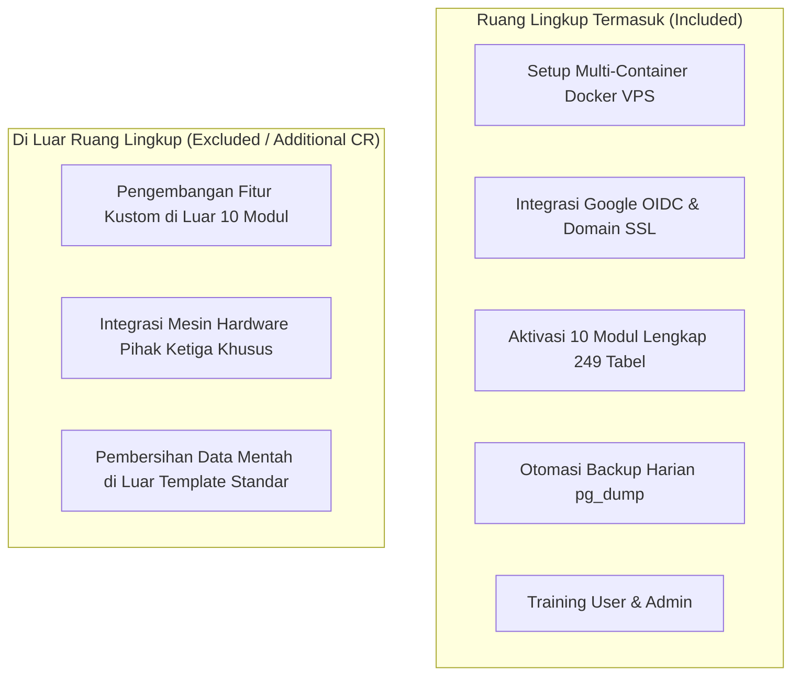

# PROPOSAL INVESTASI
## IMPLEMENTASI SISTEM INFORMASI MANAJEMEN ENTERPRISE TERPADU (HCM & E-OFFICE)
### SKEMA DEDICATED PRIVATE VPS & DATA SOVEREIGNTY

---

**Nomor Dokumen** : 012/PROP-ENT/BND/2026  
**Tanggal** : 31 Agustus 2026  
**Perihal** : Penawaran Lisensi, Setup Dedicated VPS, dan Layanan Dukungan Teknis Tahunan  
**Sifat** : Dokumen Resmi Komersial (Confidential)  

---

## 1. LATAR BELAKANG & TUJUAN

Transformasi digital pada tata kelola perusahaan menuntut sistem operasional yang terintegrasi, transparan, dan menjamin **kedaulatan data penuh (*Data Sovereignty*)**. 

Solusi ini dirancang untuk menyediakan infrastruktur sistem mandiri berbasis **Dedicated Private VPS (On-Premise Cloud)** bagi perusahaan, menggabungkan **10 Modul Bisnis Terintegrasi** tanpa risiko percampuran data dengan pihak ketiga (*non-multi-tenant*).

### Nilai Strategis Solusi:
1. **Kedaulatan Data 100%**: Server database PostgreSQL dan berkas lampiran perusahaan tersimpan eksklusif di instance VPS milik perusahaan.
2. **Arsitektur Real-Time Reaktif**: Pembaruan data presensi, persetujuan keuangan bertingkat (*Approval SLA*), dan disposisi persuratan berjalan instan via WebSocket persisten.
3. **Efisiensi Finansial (Bebas Biaya Lisensi per User)**: Menggunakan model *Unlimited Users* dalam kapasitas server dedicated.

---

## 2. SPESIFIKASI INFRASTRUKTUR TEKNIS

| Komponen | Spesifikasi Teknis | Fungsi & Keandalan |
| :--- | :--- | :--- |
| **Server VPS** | **Dedicated KVM4 Compute** • 4 vCPU High Performance • 16 GB RAM • 200 GB NVMe SSD Storage • 1 Gbps Port Network Bandwidth | Menjalankan pemrosesan data 249 tabel database, in-memory caching, dan koneksi aktif ratusan user secara simultan. |
| **Edge Ingress Gateway** | **Traefik v3 (Cloud-Native Ingress)** | Reverse proxy utama, load balancing, rate limiting, and penerbitan sertifikat SSL/TLS HTTPS otomatis (*Auto-Renew ACME*). |
| **Frontend Server** | **Caddy Server (Alpine)** | Melayani aset web static SPA dengan kompresi modern (*Zstandard & Gzip*) dan routing client-side instan. |
| **Database Engine** | **Convex Reactive Core + PostgreSQL 16** | Lapisan komputasi reaktif transaksi real-time dengan persistensi data relasional standar enterprise ACID-compliant. |
| **Cache & Message Broker** | **Redis 7 (In-Memory)** | Caching session, antrean tugas latar belakang, dan distributed lock. |
| **Async Background Worker** | **Node.js BullMQ Worker** | Pemrosesan dokumen PDF, rekap analitik, dan pengiriman notifikasi/email tanpa membebani server utama. |
| **Identity Provider (SSO)** | **Google Cloud OAuth 2.0 (OIDC)** | Akses masuk terpusat yang aman menggunakan akun korporat Google Workspace. |

---

## 3. RENCANA ANGGARAN BIAYA (RAB)

### A. Biaya Investasi Awal (One-Time / CAPEX)

| No | Komponen Pekerjaan / Item | Rincian Deliverables | Nilai Investasi (IDR) |
| :---: | :--- | :--- | :---: |
| **1** | **Jasa Setup, Instalasi & Hardening VPS** | • Instalasi OS Linux Server & Hardening Firewall (UFW). • Orkestrasi Multi-Container Docker Stack (6 Services). • Konfigurasi Traefik Ingress & Auto-SSL HTTPS. • Integrasi Google OAuth 2.0 & Binding Domain Resmi. • Konfigurasi Script Backup Database Otomatis Harian. • Setup Pipeline CI/CD GitHub Actions Zero-Downtime. | **Rp 12.500.000** |
| **2** | **Lisensi Software Enterprise (Perpetual)** | • Hak penggunaan penuh **10 Modul Lengkap** (*Core HR, Presensi, Payroll, Finance SLA, Talent 9-Box, OKR, E-Office, LMS, ATS, BOD Dashboard*). • Bebas penambahan pengguna (*Unlimited Users*). | **Rp 85.000.000** |
| **3** | **Onboarding Data & Konfigurasi Master** | • Migrasi & import data master karyawan, divisi, dan jabatan. • Setting formula payroll (BPJS, PPh 21, lembur, potongan). • Konfigurasi alur approval bertingkat dan master persuratan. | **Rp 10.000.000** |
| **4** | **Pelatihan & Alih Pengetahuan (Training)** | • Training Admin HR, Finance & System Operator (2 Hari). • Training User & Approval Manager (1 Hari). • Buku petunjuk operasional (PDF) & video tutorial. | **Rp 15.000.000** |
| **SUBTOTAL INVESTASI AWAL (CAPEX)** | | | **Rp 122.500.000** |

---

### B. Biaya Operasional & Pemeliharaan Tahunan (OPEX)

*Biaya operasional infrastruktur dan pemeliharaan teknis rutin tahunan:*

| No | Komponen Layanan | Detail Perhitungan & Spesifikasi | Biaya per Tahun (IDR) |
| :---: | :--- | :--- | :---: |
| **1** | **Sewa Dedicated VPS KVM4** | $29/bulan × 12 bulan × PPN 11% = $386.28 *(Asumsi kurs proteksi $1 = Rp 18.000)* | **Rp 7.000.000** |
| **2** | **Backup Otomatis Harian & Offsite Storage** | Rp 209.000/bulan × 12 bulan × PPN 11% = Rp 2.783.880 *(Snapshot cloud VPS + offsite storage database)* | **Rp 2.800.000** |
| **3** | **Annual Technical Support (ATS) & Maintenance** | • Jaminan SLA Uptime 99.9%. • Pembaruan patch keamanan sistem & dependensi. • Monitoring performa database, memori, & disk space. • Bantuan teknis prioritas & penanganan insiden. | **Rp 10.000.000** |
| **SUBTOTAL BIAYA TAHUNAN (OPEX)** | | | **Rp 19.800.000** *(Dibulatkan **Rp 20.000.000 / th**)* |

> *Catatan: Pada Tahun ke-1, komponen ATS dan pemeliharaan teknis telah termasuk dalam paket implementasi awal.*

---

## 4. RUANG LINGKUP PEKERJAAN (SCOPE OF WORK)

### A. Termasuk dalam Layanan (Included):
1. Pengadaan dan konfigurasi seluruh stack server VPS hingga berstatus *Production-Ready*.
2. Setup domain perusahaan (contoh: `portal.perusahaan.co.id`) dengan enkripsi SSL grade A+.
3. Pemasangan seluruh 10 modul bisnis tanpa pembatasan fitur.
4. Pengujian sistem bersama tim internal (*User Acceptance Testing / UAT*).
5. Pendampingan teknis intensif selama masa *Go-Live* (14 hari kerja pertama).

### B. Tidak Termasuk dalam Layanan (Excluded):
1. **Custom Software Development**: Penambahan modul atau alur kerja di luar spesifikasi 10 modul standar akan dituangkan dalam dokumen *Change Request (CR)* dengan kalkulasi *man-days* terpisah.
2. **Pengadaan Perangkat Keras Klien**: Pengadaan laptop, komputer, atau smartphone pengguna akhir.

---

## 5. TINGKAT LAYANAN DUKUNGAN (SERVICE LEVEL AGREEMENT - SLA)

Layanan dukungan teknis (*ATS*) memberikan perlindungan operasional dengan standar respon:

| Tingkat Keparahan (Severity) | Kriteria Insiden | Waktu Respon Awal | Target Penyelesaian Solusi |
| :--- | :--- | :---: | :---: |
| **Severity 1 (Kritis)** | Server down total, data tidak dapat diakses, atau kegagalan transaksi payroll massal. | < 30 Menit | < 4 Jam Kerja |
| **Severity 2 (Tinggi)** | Fitur utama mengalami kendala, namun sistem operasional inti masih berjalan. | < 2 Jam | < 8 Jam Kerja |
| **Severity 3 (Normal)** | Pertanyaan teknis, panduan operasional, atau kendala minor tampilan. | < 4 Jam | < 24 Jam Kerja |

* Saluran Bantuan: **Dedicated WhatsApp Support Group**, **Email Helpdesk**, dan **Remote Session (AnyDesk / SSH)**.

---

## 6. JADWAL PELAKSANAAN IMPLEMENTASI

Implementasi ditargetkan tuntas dalam waktu **4 (Empat) Minggu**:

| Minggu | Tahapan Aktivitas | Deliverables Utama |
| :---: | :--- | :--- |
| **Minggu 1** | Setup VPS, Docker Stack, Domain, SSL & Google OAuth | Server Production & Staging Live |
| **Minggu 2** | Import Master Data Karyawan, Setting Payroll & Cuti | Database Terkonfigurasi Penuh |
| **Minggu 3** | UAT (User Acceptance Testing) & Pelatihan Admin/User | Berita Acara UAT & User Siap Pakai |
| **Minggu 4** | Official Cut-Off & Go-Live Operasional Penuh | Sistem Beroperasi Mandiri |

